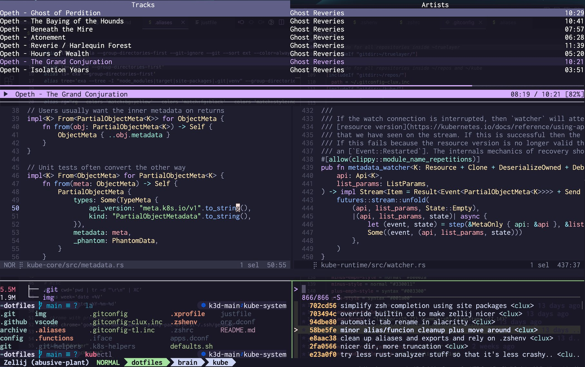

# dotfiles

[](https://github.com/clux/dotfiles/actions/workflows/lint.yml)

Personal dotfiles, and configuration for [provisioned setup](https://github.com/clux/provision).
Designed for a minimal Arch Linux installation, but retrofitted to support MacOS under duress.

## Desktop Setup

- **Linux**: [cinnamon](https://wiki.archlinux.org/index.php/cinnamon) + [guake](https://wiki.archlinux.org/index.php/Guake) via `dconf`
- **Mac**: [defaults](https://github.com/clux/dotfiles/blob/main/defaults.sh) with [hammerspoon](https://github.com/Hammerspoon/hammerspoon) + [karabiner](https://karabiner-elements.pqrs.org/docs/)

## Terminal Setup



- [zellij](https://zellij.dev/) in [alacritty](https://github.com/alacritty/alacritty/) using [zsh](https://github.com/clux/dotfiles/blob/main/.zshrc)
- [zoxide](https://github.com/ajeetdsouza/zoxide) for jumping (updates `zellij` tab names)
- [powerline](https://github.com/b-ryan/powerline-shell) style [starship prompt](https://github.com/clux/dotfiles/blob/main/config/starship.toml)
- [terminal styling](https://hachyderm.io/@clux/109815971667731738) through: [alacritty](https://github.com/alacritty/alacritty-theme#color-schemes) / [vivid](https://github.com/sharkdp/vivid/tree/master/themes) / [bat](https://github.com/sharkdp/bat/tree/master/assets/themes)[*](https://github.com/catppuccin/bat) / [hx](https://github.com/helix-editor/helix/tree/master/runtime/themes) / [zellij](https://github.com/zellij-org/zellij/tree/main/example/themes) / [delta](https://dandavison.github.io/delta/supported-languages-and-themes.html#supported-languages-and-themes)[*](https://dandavison.github.io/delta/custom-themes.html?highlight=theme#custom-themes) / [starship](https://starship.rs/advanced-config/#style-strings) / [ripgrep](https://github.com/BurntSushi/ripgrep/blob/master/GUIDE.md#configuration-file) / [fzf](https://github.com/catppuccin/fzf) -> see [invocations](https://github.com/clux/dotfiles/search?o=desc&q=theme&s=indexed)
- [kubernetes helpers](https://github.com/clux/dotfiles/blob/main/.k8s-helpers) with abbrev aliases, ns/ctx switchers, interactive lookup fns using `fzf`
- [gitconfig](https://github.com/clux/dotfiles/blob/main/.gitconfig) with [fzf](https://github.com/junegunn/fzf) based [git helpers](https://github.com/clux/dotfiles/blob/main/.git-helpers), diff via [delta](https://github.com/dandavison/delta), and account switching by `includeIf` dirs
- [keychain](https://wiki.archlinux.org/index.php/SSH_keys#Keychain) loading specific ssh keys by host
- [aliases](https://github.com/clux/dotfiles/blob/main/.aliases) to gracefully move from `ls`->`exa`, `ag`->`rg`, `cat`->`bat`
- editor settings for [helix](https://github.com/clux/dotfiles/blob/main/config/helix/config.toml) + [vscode](https://github.com/clux/dotfiles/tree/main/share/Code/User)

Plus lots of misc [.functions](https://github.com/clux/dotfiles/blob/main/.functions). As usual, copy what you find interesting.

## Usage
Clone and apply:

```sh
just link # force symlink to ~/ + ~/.config/ + CONFIG_HOME
just system # defaults write (mac) / dconf load (linux)
```

All recipes are idempotent.

Note the distinction between the [config](https://github.com/clux/dotfiles/blob/main/config) directory (for unix apps that hardcode `~/.config` or `XDG_CONFIG_HOME`) vs. the [share](https://github.com/clux/dotfiles/blob/main/share) directory (for apps that uses [platform specifics](https://docs.rs/dirs/4.0.0/dirs/fn.config_dir.html)). These two folders are the same on Linux, but are separated here to support other platforms.
